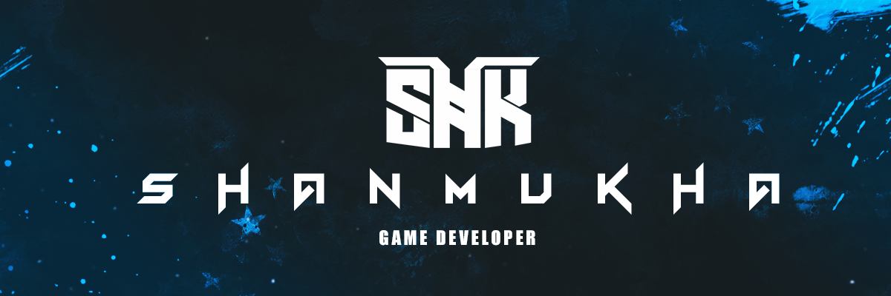

### 🎮 Aspiring Game Developer

🚀 I’m a student currently learning **Game Development**  
🧠 Practicing **C++**, **Unreal Engine**, and **Unity**  
🎯 Focused on both **2D** and **3D game development**  
⚙️ Exploring game mechanics, engine scripting, and optimization  
🧪 Building small projects to experiment and grow my skills  

 
## 🔗 My Links

---

### 🛠 Tech Stack

---

### 📈 GitHub Stats

---

> 💡 _“Always learning. Always building. Always leveling up.”_
